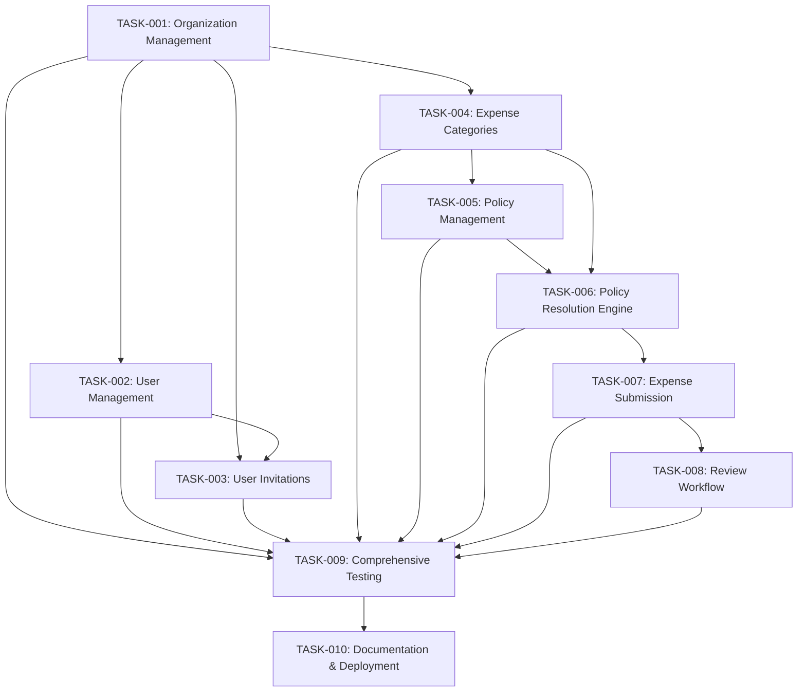

# Expense Management System - Implementation Plan

## Overview

This document outlines the implementation plan for the core expense management system based on the Product Requirements Document (PRD). The plan follows a feature-by-feature approach where each task includes database schema changes, API implementation, and UI components together.

## Implementation Strategy

We're using a feature-by-feature approach rather than implementing all database schema upfront. This allows us to:
- Validate each feature end-to-end as we progress
- Get early feedback on functionality
- Reduce complexity by focusing on one feature at a time
- Ensure proper integration between components

## Task Dependencies

## Task List

### Core Foundation (P0 Priority)

1. **[TASK-001: Organization Management](001-org-management.md)** - Implement organization creation, management, and UserOrganization membership model with admin role assignment
2. **[TASK-002: User Management](002-user-management.md)** - Enhance user management with role-based access control and permissions (builds on UserOrganization from Task 1)
3. **[TASK-003: User Invitations](003-user-invitations.md)** - Implement invitation system for organization growth
4. **[TASK-004: Expense Categories](004-expense-categories.md)** - Create category management for expense classification

### Policy & Expense Engine (P0 Priority)

5. **[TASK-005: Policy Management](005-policy-management.md)** - Implement policy configuration and management
6. **[TASK-006: Policy Resolution Engine](006-policy-resolution-engine.md)** - Build engine for determining applicable policies
7. **[TASK-007: Expense Submission](007-expense-submission.md)** - Create core expense submission workflow
8. **[TASK-008: Review Workflow](008-review-workflow.md)** - Implement approval/rejection workflow

### Quality & Production Readiness (P1 Priority)

9. **[TASK-009: Comprehensive Testing](009-comprehensive-testing.md)** - Add thorough testing across all features
10. **[TASK-010: Documentation & Deployment](010-documentation-deployment.md)** - Update documentation and prepare for production

## Implementation Order

The tasks are ordered to build dependencies incrementally:

1. **Foundation First**: Organization Management establishes the multi-tenant foundation with UserOrganization model
2. **Role-Based Access**: User Management builds upon the membership model to implement permissions
3. **Growth Enablement**: Invitations allow organizations to add users
4. **Classification**: Categories provide a structure for policies and expenses
5. **Rules Engine**: Policy Management and Resolution Engine enforce business rules
6. **Core Functionality**: Expense Submission and Review Workflow deliver the main value
7. **Quality Assurance**: Testing ensures reliability and security
8. **Production Ready**: Documentation and deployment enable real-world usage

## Key Technical Decisions

- **T3 Stack**: Using Next.js, TypeScript, Prisma, tRPC, and NextAuth
- **Feature-by-Feature**: Each task includes DB, API, and UI components
- **Transactional Testing**: Using `@chax-at/transactional-prisma-testing` for database tests
- **Multi-tenancy**: All business data is organization-scoped
- **Role-Based Access**: Admin/Member roles with proper authorization
- **Policy-Driven**: All expenses validated against configurable policies
- **Membership Model**: UserOrganization relationship established in Task 1 for better foundation

## Success Metrics

From the PRD, we're aiming to achieve:
- **Time to Process Expense**: Reduce from 7 days to <2 days average
- **Policy Compliance**: 95% of expenses follow defined policies
- **User Adoption**: 80% of organization members actively using system
- **Auto-approval Rate**: 70% of compliant expenses auto-approved

## Next Steps

1. Review and approve this implementation plan
2. Begin with TASK-001: Organization Management (includes UserOrganization model)
3. Progress through tasks in dependency order
4. Regularly review progress against success metrics
5. Adjust plan based on implementation learnings

## Notes

- Each task is designed to be completable in 1-3 days
- Tasks include comprehensive TODO lists for detailed tracking
- All tasks follow established project patterns and standards
- The plan is flexible and can be adjusted based on priorities
- Task 1 now includes the UserOrganization model to provide a better foundation for subsequent tasks